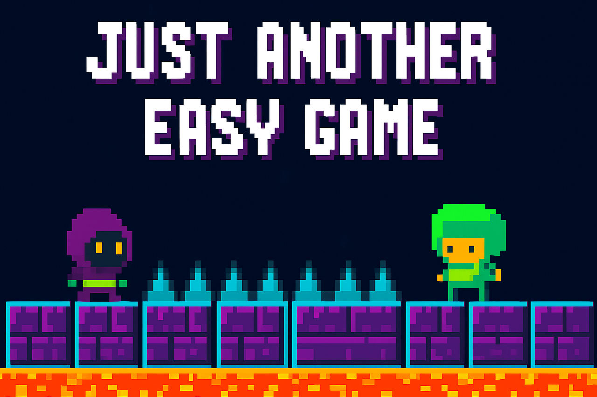

# Just Another Easy Game

 

A simple (not really) 2nd platformer game built using [raylib](https://www.raylib.com/).  
You can also play it online: [Play on itch.io](https://am1n-1602.itch.io/just-another-easy-game) 

---

## Features

- Fully functional 2nd platformer game
- Built in C++ with **raylib** for graphics, input, and audio
- Main menu, playing, pause, and game-over states
- Background music and in-game sound effects
- Game time tracking and state management
- Clean structure for learning game development basics

## Getting Started

### Prerequisites

- C++17 compatible compiler (g++, clang++, MSVC, etc.)
- [raylib](https://www.raylib.com/) library installed (version 4.0 or higher recommended)
- [CMake](https://cmake.org/) 3.10 or newer

### Building with CMake

Clone the repository:
```bash
git clone https://github.com/Am1n1602/Just-another-easy-game.git
cd Just-another-easy-game
```

```bash
mkdir build
cmake ..
cd build
build
```
The executable will be in `build/`.

### Running

Run the game:
```bash
./build/Just_Another_Easy_Game
```

Or play online: [Play on itch.io](https://am1n-1602.itch.io/just-another-easy-game) 

---

## Controls

- **A** — Move left
- **D** — Move right
- **SPACE** — Jump
- **ESC** — Request to exit (from menu)
- **Y** / **N** — Confirm or cancel exit prompt

---

## Code Structure

- `src/` — all the cpp files 
- `libs/` — all headers/include files
- `assets/` — Game assets (audio, fonts, etc.)

---


## Credits

See `CREDITS.TXT` for full attributions.

---

Made with ❤️ by [Am1n1602](https://github.com/Am1n1602)
